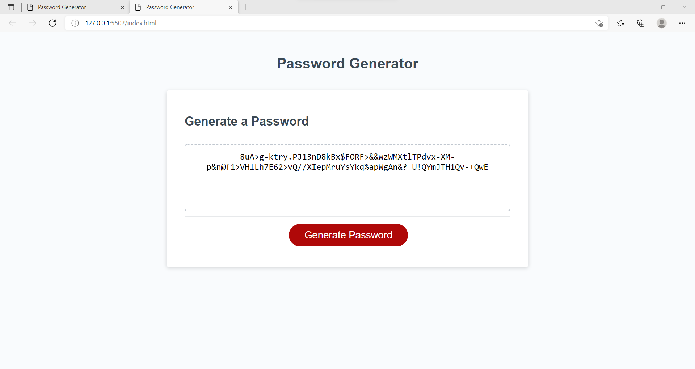

# Password-generator
homwork3 JS password generator 

This application will prompt requirements to generate a random password. When running the application, you will be asked if you want lower and uppercase letters for your password, then you will be asked if you want to included numbers and special characters. After the promps, you will have a random password in the length you choose and all requirements in propmts. 

password generated will meet these requirements:
> Must be 8 character minimum and not longer than 128 characters.
> Must have at least one lowercase and one uppercase letter.
> Must have at least one special charater. 

-git hub repo <https://github.com/Bertokeys1/Password-generator>
-live page <https://bertokeys1.github.io/Password-generator/>

